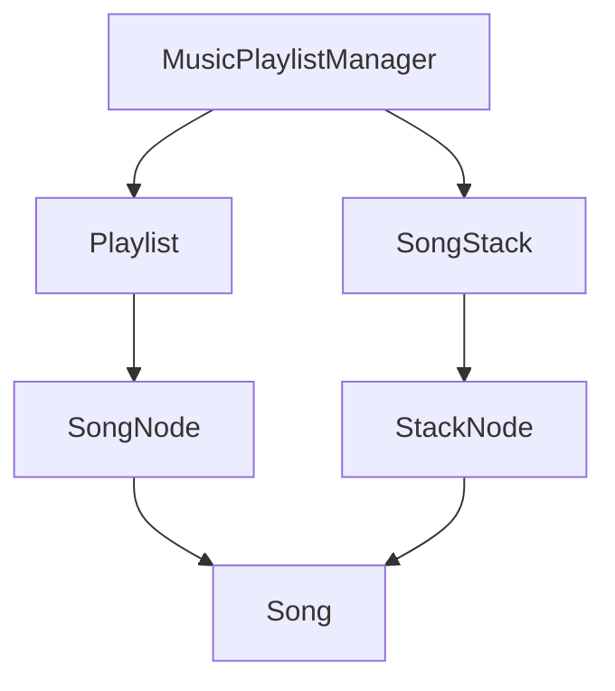

 <div align="center">

# 🎵 Music Playlist Manager

### A Console-Based Java Application for Playlist & Play-History Management

[](https://www.oracle.com/java/)
[](LICENSE)
[](#-architecture)
[](#-usage)

**A Java-based music player simulation demonstrating Singly Linked Lists, Stacks, Searching, and Sorting algorithms.**

[Overview](#-overview) • [Features](#-features) • [Architecture](#-architecture) • [Complexity Analysis](#-complexity-analysis) • [Installation](#-getting-started) • [Usage](#-usage) • [License](#-license)

</div>

---

## 📖 Overview

**Music Playlist Manager** is a menu-driven Java console application designed to demonstrate the practical implementation of fundamental data structures and algorithms.

The application allows users to create and manage a music playlist, search for songs, remove tracks, sort songs alphabetically, and maintain a history of recently played songs.

The project uses two primary data structures:

* **Singly Linked List:** Stores songs dynamically and supports insertion, deletion, searching, displaying, and sorting.
* **Stack:** Maintains playback history using the Last-In, First-Out (LIFO) principle.

The application is developed using Java and object-oriented programming concepts. All data structures are implemented manually using custom nodes instead of Java's built-in linked-list and stack collections.

### 🎯 Project Objectives

* Understand the implementation of a singly linked list.
* Implement stack operations using linked nodes.
* Apply linear search to locate songs.
* Use bubble sort to arrange songs alphabetically.
* Understand the LIFO principle through playback history.
* Apply object-oriented programming concepts in Java.
* Analyze the time and space complexity of data structure operations.
* Develop a functional, menu-driven console application.

---

## ✨ Features

### 🎼 Playlist Management

* **Add Song:** Add a song by entering its title and artist name.
* **Remove Song:** Delete a song by its title.
* **Display Playlist:** Display all songs with sequential numbering.
* **Search Song:** Find a song by title using linear search.
* **Sort Playlist:** Arrange songs alphabetically using bubble sort.

### ▶️ Playback and History Management

* **Play Song:** Simulate playing a song selected from the playlist.
* **Recently Played:** Display playback history with the most recently played song first.
* **Undo Last Play:** Remove the latest history entry using the stack's `pop()` operation.
* **Peek Last Played:** View the top entry without removing it from the stack.
* **Empty Stack Handling:** Display a message when the history stack is empty.

### 🛡️ Input Validation

* Reject empty song titles.
* Reject empty artist names.
* Handle non-numeric menu input.
* Validate empty search and removal requests.
* Display messages when songs cannot be found.
* Handle attempts to view or remove entries from an empty history stack.

---

## 🧱 Architecture

The project follows a class-based structure in which each class has a specific responsibility.

### Class Design

| Class                  | Responsibility                                                                           |
| ---------------------- | ---------------------------------------------------------------------------------------- |
| `Song`                 | Stores the title and artist of a song.                                                   |
| `SongNode`             | Represents a node in the playlist linked list.                                           |
| `Playlist`             | Implements song insertion, deletion, searching, displaying, and sorting.                 |
| `StackNode`            | Represents a node in the playback history stack.                                         |
| `SongStack`            | Implements stack operations, including `push()`, `pop()`, `peek()`, and history display. |
| `MusicPlaylistManager` | Contains the `main()` method and manages the user interface and menu operations.         |

### System Architecture



### 1. Song Class

The `Song` class represents a music track.

Each song contains two attributes:

* `title`: The name of the song.
* `artist`: The name of the artist.

A constructor initializes these attributes when a new song object is created.

### 2. Singly Linked List

The `Playlist` class uses `SongNode` objects to store songs.

Each node contains a `Song` reference and a reference to the next node.

```text
HEAD
 |
 v
[Song 1 | Next] -> [Song 2 | Next] -> [Song 3 | null]
```

The linked list supports:

* Inserting songs at the end.
* Removing songs by title.
* Searching for songs.
* Displaying the playlist.
* Sorting songs alphabetically.

The playlist maintains a reference to its first node, called `head`.

### 3. Stack

The `SongStack` class uses `StackNode` objects to maintain recently played songs.

The stack follows the **Last-In, First-Out (LIFO)** principle.

```text
        TOP
         |
         v
    +----------+
    |  Song C  |  Most recently played
    +----------+
         |
         v
    +----------+
    |  Song B  |
    +----------+
         |
         v
    +----------+
    |  Song A  |
    +----------+
         |
        null
```

The stack supports the following operations:

* `push()`: Adds a song to the top of the stack.
* `pop()`: Removes the top entry.
* `peek()`: Displays the top entry without removing it.
* `isEmpty()`: Checks whether the stack contains any entries.
* `displayHistory()`: Displays all history entries from newest to oldest.

### 4. Main Class

The `MusicPlaylistManager` class contains the application's entry point.

It displays a menu, accepts user input through Java's `Scanner`, and calls the appropriate methods in the `Playlist` and `SongStack` classes.

---

## 📊 Complexity Analysis

Let \(n\) represent the number of songs in the playlist and \(h\) represent the number of entries in the playback history.

| Operation                    | Algorithm or Data Structure | Time Complexity                   |
| ---------------------------- | --------------------------- | --------------------------------- |
| Add song                     | Singly Linked List          | \(O(n)\)                          |
| Remove song                  | Linear Traversal            | \(O(n)\)                          |
| Display playlist             | Traversal                   | \(O(n)\)                          |
| Search song                  | Linear Search               | \(O(n)\)                          |
| Sort playlist                | Bubble Sort                 | \(O(n^2)\) average and worst case |
| Push song to history         | Stack                       | \(O(1)\)                          |
| Pop history entry            | Stack                       | \(O(1)\)                          |
| Peek history entry           | Stack                       | \(O(1)\)                          |
| Check whether stack is empty | Stack                       | \(O(1)\)                          |
| Display playback history     | Stack Traversal             | \(O(h)\)                          |
| Play a song                  | Linear Search + Stack Push  | \(O(n)\)                          |

### Explanation

**Insertion:** The playlist stores only a reference to the first node. To add a song at the end, the program traverses the existing nodes until it reaches the last node. Therefore, insertion takes \(O(n)\) time.

**Deletion:** The program searches for the requested title before updating the node references. In the worst case, it traverses the entire list, resulting in \(O(n)\) time.

**Searching:** Each song title is checked sequentially until a match is found or the list ends. This is linear search with \(O(n)\) worst-case time complexity.

**Sorting:** Bubble sort repeatedly compares adjacent song titles and swaps their `Song` references when they are in the wrong order. Its average and worst-case time complexity is \(O(n^2)\). Because the implementation stops when no swaps occur, its best-case time complexity is \(O(n)\).

**Stack operations:** The stack maintains a reference to its top node. Pushing, popping, and peeking require no traversal, so each takes \(O(1)\) time.

### Space Complexity

| Component                    | Space Complexity |
| ---------------------------- | ---------------- |
| Playlist storage             | \(O(n)\)         |
| Playback history storage     | \(O(h)\)         |
| Total data structure storage | \(O(n+h)\)       |
| Bubble sort auxiliary space  | \(O(1)\)         |

The linked list and stack allocate nodes dynamically as new entries are added. Bubble sort swaps song references between existing nodes and does not create another list.

---

## 🛠️ Technologies Used

* **Programming Language:** Java 17 or later
* **Programming Paradigm:** Object-Oriented Programming
* **Data Structures:** Singly Linked List and Stack
* **Searching Algorithm:** Linear Search
* **Sorting Algorithm:** Bubble Sort
* **Input Handling:** Java `Scanner`
* **Interface:** Command-Line Interface (CLI)
* **Development Environment:** Visual Studio Code, Eclipse, IntelliJ IDEA, or another Java-compatible IDE

The project does not require external libraries.

---

## 🚀 Getting Started

Follow these instructions to compile and run the application on your computer.

### Prerequisites

Install the Java Development Kit (JDK), version 17 or later.

Verify your installation using the terminal:

```bash
java -version
javac -version
```

Both commands should display a valid Java version.

If either command is not recognized, install a JDK and configure its `bin` directory in your system's `PATH`.

### Installation

#### Step 1: Clone the Repository

```bash
git clone https://github.com/YOUR-USERNAME/MusicPlaylistManager.git
```

Replace `YOUR-USERNAME` and the repository name with the values used on your GitHub account.

#### Step 2: Navigate to the Project Directory

```bash
cd MusicPlaylistManager
```

#### Step 3: Compile the Java Source File

```bash
javac MusicPlaylistManager.java
```

This command compiles the Java source file and generates the required `.class` files.

#### Step 4: Run the Application

```bash
java MusicPlaylistManager
```

The main menu will appear in the terminal.

### Running in Visual Studio Code

1. Install the JDK.
2. Install the **Extension Pack for Java** in VS Code.
3. Open the folder containing `MusicPlaylistManager.java`.
4. Open the Java source file.
5. Click **Run** above the `main()` method, or run the compilation and execution commands in the integrated terminal.

**Note:** This project uses arrow-style `switch` cases, so Java 17 or later is recommended.

---

## 💻 Usage

When the application starts, it displays the following menu:

```text
===== MUSIC PLAYLIST MANAGER =====
1. Add Song
2. Remove Song
3. Display Playlist
4. Search Song
5. Sort Playlist
6. Play Song
7. View Recently Played
8. Undo Last Play (Pop)
9. View Last Played Song (Peek)
0. Exit
Enter your choice:
```

### Menu Options

| Option | Action                                         |
| ------ | ---------------------------------------------- |
| `1`    | Add a song to the playlist.                    |
| `2`    | Remove a song by title.                        |
| `3`    | Display all songs.                             |
| `4`    | Search for a song by title.                    |
| `5`    | Sort songs alphabetically.                     |
| `6`    | Simulate playing a song and add it to history. |
| `7`    | Display recently played songs.                 |
| `8`    | Remove the latest history entry.               |
| `9`    | View the most recently played song.            |
| `0`    | Exit the application.                          |

### Example Execution

**1. Add a song**

```text
Enter your choice: 1
Enter song title: Believer
Enter artist name: Imagine Dragons
Song added successfully!
```

**2. Add another song**

```text
Enter your choice: 1
Enter song title: Perfect
Enter artist name: Ed Sheeran
Song added successfully!
```

**3. Display the playlist**

```text
Enter your choice: 3
1. Believer - Imagine Dragons
2. Perfect - Ed Sheeran
```

**4. Search for a song**

```text
Enter your choice: 4
Enter title to search: Perfect
Song found: Perfect - Ed Sheeran
```

**5. Sort the playlist**

```text
Enter your choice: 5
Playlist sorted alphabetically!
```

**6. Play a song**

```text
Enter your choice: 6
Enter song title to play: Believer
Now playing: Believer - Imagine Dragons
```

**7. View playback history**

```text
Enter your choice: 7
Recently Played (newest first):
1. Believer - Imagine Dragons
```

**8. Peek at the most recent entry**

```text
Enter your choice: 9
Last played: Believer - Imagine Dragons
```

**9. Undo the last play**

```text
Enter your choice: 8
Removed from history: Believer
```

**10. Exit the application**

```text
Enter your choice: 0
Goodbye!
```

These are illustrative examples of the application's expected behavior, not screenshots or verified execution logs.

---

## 📁 Project Structure

The project uses a single Java source file containing all six classes.

```text
MusicPlaylistManager/
│
├── MusicPlaylistManager.java
├── README.md
├── LICENSE
└── .gitignore
```

### File Descriptions

| File                        | Description                                                                               |
| --------------------------- | ----------------------------------------------------------------------------------------- |
| `MusicPlaylistManager.java` | Contains the song model, linked-list implementation, stack implementation, and main menu. |
| `README.md`                 | Provides project documentation, installation instructions, and complexity analysis.       |
| `LICENSE`                   | Specifies the terms under which the project can be used and distributed.                  |
| `.gitignore`                | Excludes generated class files and unnecessary IDE files from Git.                        |

### Recommended `.gitignore`

```gitignore
*.class
.vscode/
.idea/
*.iml
.DS_Store
```

The `.gitignore` file prevents compiled Java class files and common IDE-specific files from being included in Git commits.

---

## 🧪 Testing Checklist

Use this checklist to verify the application's functionality.

### Playlist Operations

* [ ] Add a song with a valid title and artist.
* [ ] Add multiple songs.
* [ ] Display the complete playlist.
* [ ] Search for an existing song.
* [ ] Search for a nonexistent song.
* [ ] Remove an existing song.
* [ ] Attempt to remove a nonexistent song.
* [ ] Sort songs alphabetically.
* [ ] Test sorting with zero, one, and multiple songs.
* [ ] Verify that title matching is case-insensitive.

### Stack Operations

* [ ] Play an existing song.
* [ ] Play multiple songs.
* [ ] Display history in newest-first order.
* [ ] Peek at the latest history entry.
* [ ] Pop the latest history entry.
* [ ] Attempt to pop from an empty stack.
* [ ] Attempt to peek at an empty stack.

### Input Validation

* [ ] Enter a non-numeric menu choice.
* [ ] Enter an invalid numeric menu option.
* [ ] Submit an empty song title.
* [ ] Submit an empty artist name.
* [ ] Enter an empty search query.
* [ ] Enter an empty removal query.

---

## 🎓 Learning Outcomes

By developing this project, students can gain practical experience with:

* Creating and manipulating linked-list nodes.
* Traversing a singly linked list.
* Inserting and deleting elements dynamically.
* Implementing linear search.
* Applying bubble sort to linked-list data.
* Implementing stack operations with custom nodes.
* Understanding the LIFO principle.
* Using Java classes, objects, constructors, and methods.
* Handling console input and invalid entries.
* Analyzing algorithmic time and space complexity.

This project is suitable for introductory Data Structures coursework and Java programming practice.

---

## 🔮 Future Improvements

The following features could extend the project beyond its current console-based implementation:

* **Unique Song IDs:** Distinguish songs that share the same title.
* **Duplicate Detection:** Warn users before adding an identical track.
* **Playlist Persistence:** Save songs to a file and reload them when the application starts.
* **Multiple Playlists:** Allow users to create and manage separate playlists.
* **Playback Navigation:** Implement next-song and previous-song operations.
* **Shuffle and Repeat:** Add additional playlist controls.
* **Graphical User Interface:** Build a desktop interface using Java Swing or JavaFX.
* **Audio Playback:** Integrate an audio library to play actual music files.
* **Automated Testing:** Add unit tests for linked-list operations, stack operations, and sorting.
* **Improved Sorting:** Implement merge sort for better asymptotic performance on larger playlists.

These improvements are proposed extensions and are not currently implemented.

---

## 🤝 Contributing

Contributions, bug reports, and suggestions are welcome.

### How to Contribute

1. Fork the repository.

2. Create a feature branch:

   ```bash
   git checkout -b feature/your-feature
   ```

3. Implement your changes.

4. Compile the project and test the relevant functionality.

5. Commit your changes:

   ```bash
   git commit -m "Add your feature"
   ```

6. Push your branch:

   ```bash
   git push origin feature/your-feature
   ```

7. Open a pull request with a clear description of your changes.

Please keep contributions consistent with the project's Java version and existing coding style.

---

## 📄 License

This project is intended to be distributed under the MIT License.

Create a file named `LICENSE` in the root directory and include the following text. Replace `[YEAR]` and `[YOUR NAME]` with the appropriate information.

```text
MIT License

Copyright (c) [2026] [Mariha Qaiser]

Permission is hereby granted, free of charge, to any person obtaining a copy
of this software and associated documentation files (the "Software"), to deal
in the Software without restriction, including without limitation the rights
to use, copy, modify, merge, publish, distribute, sublicense, and/or sell
copies of the Software, and to permit persons to whom the Software is
furnished to do so, subject to the following conditions:

The above copyright notice and this permission notice shall be included in all
copies or substantial portions of the Software.

THE SOFTWARE IS PROVIDED "AS IS", WITHOUT WARRANTY OF ANY KIND, EXPRESS OR
IMPLIED, INCLUDING BUT NOT LIMITED TO THE WARRANTIES OF MERCHANTABILITY,
FITNESS FOR A PARTICULAR PURPOSE AND NONINFRINGEMENT. IN NO EVENT SHALL THE
AUTHORS OR COPYRIGHT HOLDERS BE LIABLE FOR ANY CLAIM, DAMAGES OR OTHER
LIABILITY, WHETHER IN AN ACTION OF CONTRACT, TORT OR OTHERWISE, ARISING FROM,
OUT OF OR IN CONNECTION WITH THE SOFTWARE OR THE USE OR OTHER DEALINGS IN THE
SOFTWARE.
```

---

<div align="center">

### 🎵 Music Playlist Manager

**Built with Java | Powered by Data Structures | Designed for Learning**

*A practical demonstration of linked lists, stacks, searching, and sorting.*

</div>
